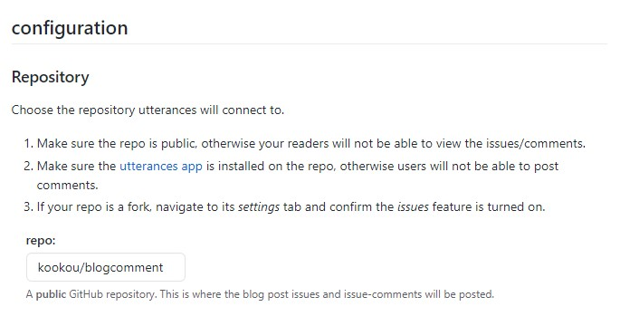
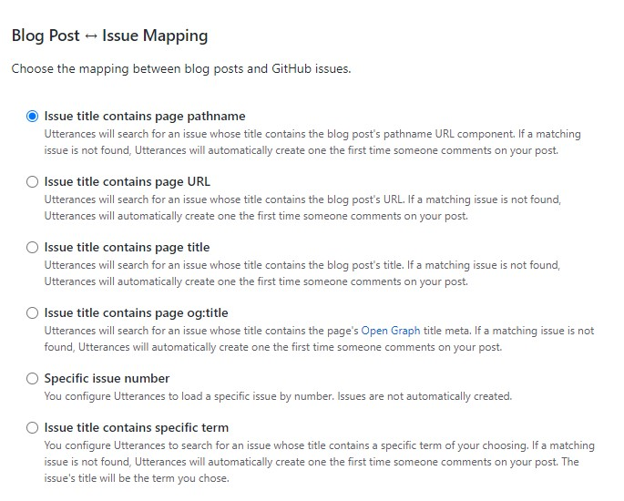
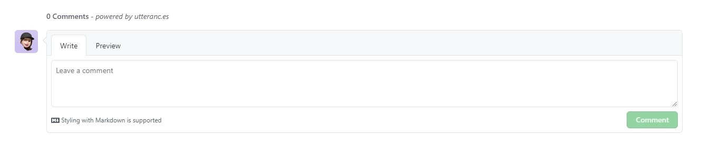

### **Disqus 에서 Utterances 로 바꾼다**

Discus 너무한다 방문자하나 없는 블로그에 광고가 댓글 위아래로 붙었다.  
없애고 싶으면 한달에 11 달러를 지불하라고 한다.  
안쓸게 👿

### Utterances 로 댓글 적용

- **github에 댓글 관리를 위한 새로운 repository를 생성한다.**  
  새로운 repository를 생성하지 않고 자신이 사용하고있는 gitblog repository를 사용해도 무관하다.  
  _이후 블로그에 댓글이 등록되면 issues에 업로드되기 때문!_

- **Utterances app을 github 계정에 추가한다.**  
  [utterances github](github.com/apps/utterances)로 접속해 Only Select Repositories를 선택하여 댓글을 관리할 repository를 지정한후 install한다.

- **Install 한후에 나오는 페이지를 작성한다.**  
   
  repo : Install 하기전 댓글관리를 위해 지정한 reopsitory 를 적어준다. (github아이디/저장소이름)

  - ex) kookou/comments
  - ex) kookou/kookou.github.io

  
  Blog Post - Issue Mapping : 댓글이 달린 블로그 페이지와 매핑시킬 Key를 결정한다.  
  _매핑 Key이니 만큼 고유하고 수정을 제일 안할것 같은 pathname을 선택하는것이 좋을듯_

- **블로그에 반영하기**  
    
  Theme : Utterances의 테마를 정한다. 어떤 테마인지는 선택해보면 하단 댓글창을 통해 확인할 수 있다.  
  Enable Utterances : 원하는 Label (깃 이슈 라벨) 명칭과 Theme (테마)을 선택하고 Copy 버튼을 클릭하여  
  댓글이 들어가길 원하는 위치에 붙여 넣어 주면 된다.

### **React를 사용한다면?**

gatsby 는 React 기반이므로~ 다음과 같은 Utterances 컴포넌트를 작성한다.

```
import React, { createRef, useLayoutEffect } from 'react';

const src = 'https://utteranc.es/client.js';

export interface IUtterancesProps {
repo: string;
theme: string;
}

const Utterances: React.FC<IUtterancesProps> = React.memo(({ repo, theme }) => {
const containerRef = createRef<HTMLDivElement>();

useLayoutEffect(() => {
const utterances = document.createElement('script');

      const attributes = {
      src,
      repo,
      theme,
      'issue-term': 'pathname',
      label: '✨💬 comments ✨',
      crossOrigin: 'anonymous',
      async: 'true',
      };

      Object.entries(attributes).forEach(([key, value]) => {
      utterances.setAttribute(key, value);
      });

      containerRef.current!.appendChild(utterances);

}, [repo]);

return <div ref={containerRef} />;
});

Utterances.displayName = 'Utterances';

export default Utterances;
```

이후에 Utterances 컴포넌트를 호출하여 원하는 위치에 삽입하면 끝 !

```
...
<Utterances repo='kookou/blogcomment' theme='github-light' />
```

- **완성**
  

참고

Gatsby 블로그 - utterances 소셜 댓글 기능 도입하기 [Blausee](https://wwlee94.github.io/category/blog/getting-started-utterances/)  
[Github 블로그] utterances 으로 댓글 기능 만들기 (+ disqus 비추후기) [공부하는 식빵맘](https://ansohxxn.github.io/blog/utterances/)
